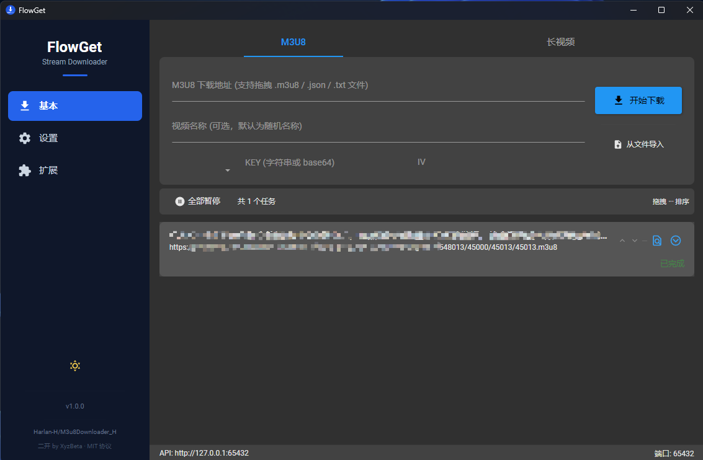
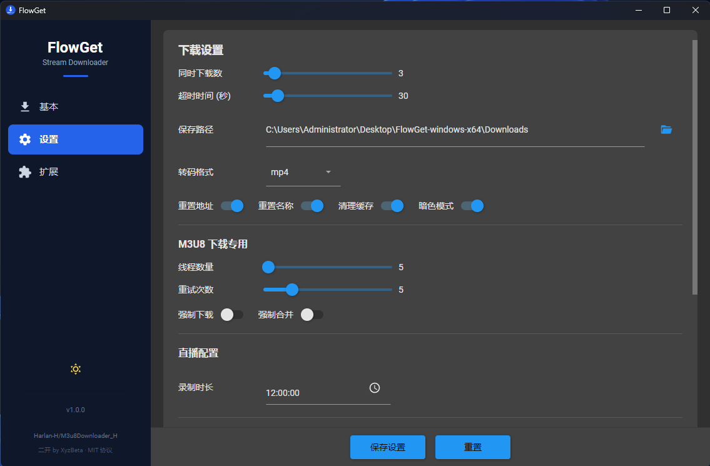
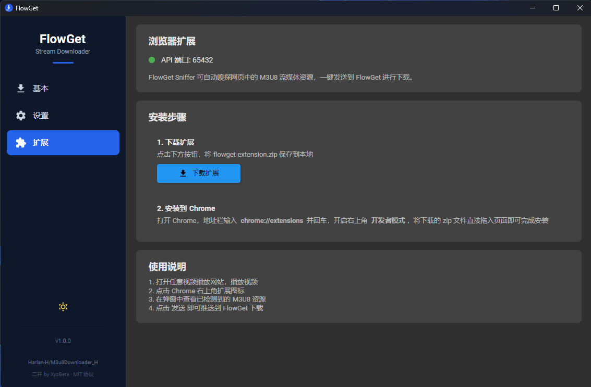
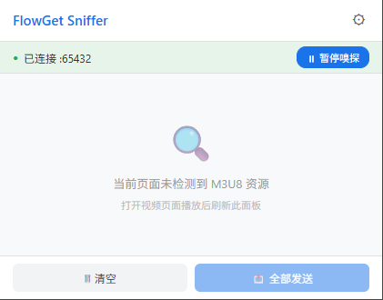
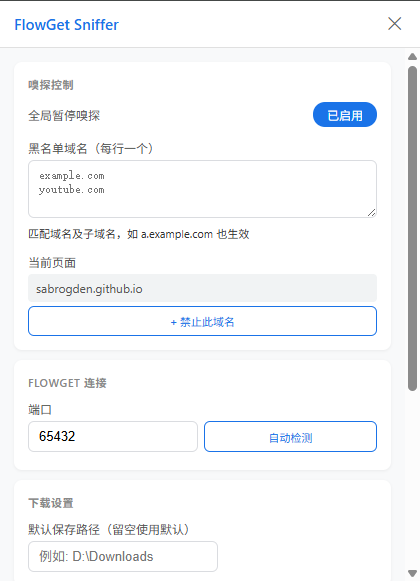

# FlowGet

M3U8/HLS 视频流下载工具，跨平台桌面应用（Windows / macOS / Linux）。

## 版权声明

本项目基于 [Harlan-H/M3u8Downloader_H](https://github.com/Harlan-H/M3u8Downloader_H) 二次开发，原始项目使用 MIT 协议。

- **原作者**: [Harlan-H](https://github.com/Harlan-H)
- **原项目地址**: <https://github.com/Harlan-H/M3u8Downloader_H>
- **插件项目**: <https://github.com/Harlan-H/M3u8Downloader_H.Plugins>
- **帮助文档**: <https://github.com/Harlan-H/M3u8Downloader_H/wiki/>

感谢原作者的开源贡献。

## 特点

- 支持多线程、多任务、断点续传
- 支持 AES-128-CBC / AES-192-CBC / AES-256-CBC 自动解密
- 支持 M3U8 的 TS、fMP4 格式下载
- 支持代理配置（含账号密码认证），即时生效无需重启
- 自动识别并转换 PNG、JPG、BMP 等伪装格式的 TS 流
- 自动识别直播流并持续下载
- 支持自定义请求头
- 支持 JSON 等方式传入 M3U8 内容
- 内嵌 HTTP REST API，支持任意语言调用
- 插件系统，支持个性化下载需求定制
- 配套 Chrome 扩展，一键嗅探网页 M3U8 资源

## 截图

### 基本功能


### 设置页面


### 扩展模块


### Chrome 扩展
| 弹出窗口 | 配置页面 |
|:--:|:--:|
|  |  |

## 构建

需要 [.NET 10 SDK](https://dotnet.microsoft.com/download/dotnet/10.0)。

```bash
# 构建解决方案
dotnet build FlowGet.sln

# 运行桌面应用
dotnet run --project FlowGet

# 发布单文件（Windows x64）
dotnet publish FlowGet -c Release -r win-x64 --self-contained true /p:PublishSingleFile=true

# 发布单文件（macOS）
dotnet publish FlowGet -c Release -r osx-x64 --self-contained true /p:PublishSingleFile=true

# 发布单文件（Linux x64）
dotnet publish FlowGet -c Release -r linux-x64 --self-contained true /p:PublishSingleFile=true
```

发布时自动下载对应平台的 FFmpeg，无需手动准备。

## Chrome 扩展

Chrome 扩展源码位于 `flowget-sniffer-pkg/source/`，可嗅探网页中的 M3U8 资源并通过 REST API 发送到 FlowGet 下载。

```bash
# 打包扩展
cd flowget-sniffer-pkg/source && zip -r ../flowget-sniffer-extension.zip .
```

在 Chrome 开发者模式中加载该目录或 ZIP 文件即可使用。

## 协议

- 本项目使用 [MIT](LICENSE.txt) 协议
- 原始项目 [M3u8Downloader_H](https://github.com/Harlan-H/M3u8Downloader_H) 使用 MIT 协议
